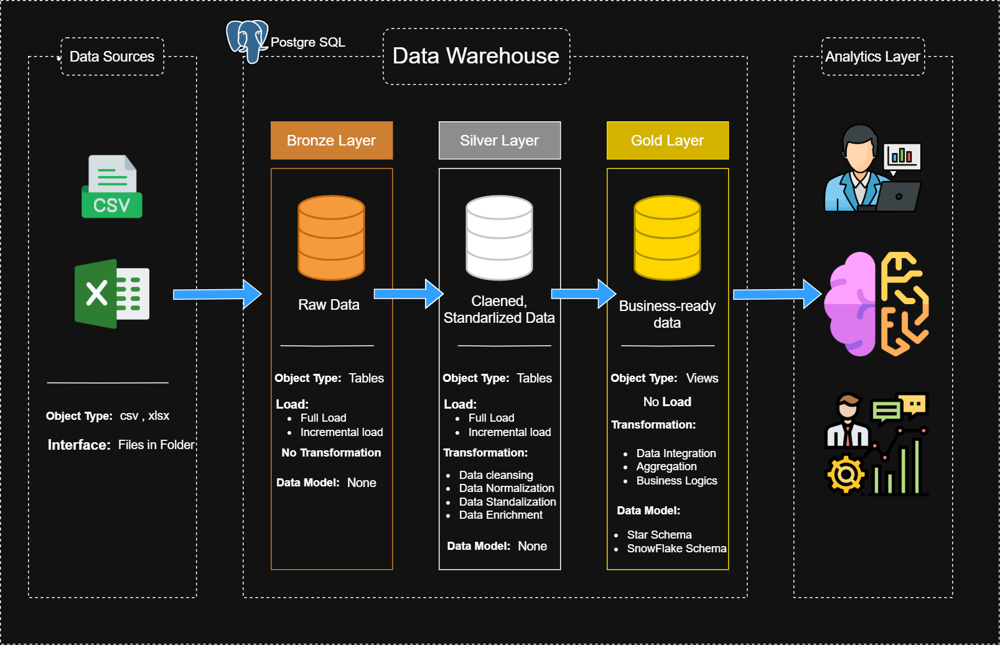

# 📊 Blinkit Data Warehouse (PostgreSQL)

## 📌 Overview
This project is a complete **Data Warehouse implementation using PostgreSQL**, designed to process and analyze operational data from a Blinkit-like quick commerce system.

It follows a **layered architecture (Bronze → Silver → Gold)** to ensure scalable, maintainable, and high-quality data pipelines for analytics.

---

## 🏗️ Architecture

The project follows a **modern Medallion Architecture (Bronze → Silver → Gold)** for scalable and structured data processing.

<p align="center">
  
</p>

---

### 🔹 Bronze Layer (Raw Data)
- Ingests raw data directly from CSV source files  
- No transformations applied  
- Preserves source-level data for traceability  
- Acts as the **single source of truth**

---

### 🔹 Silver Layer (Cleaned & Transformed Data)
- Performs data cleaning and validation  
- Standardizes formats (e.g., phone, email, text fields)  
- Applies business rules and transformations  
- Handles missing, invalid, and inconsistent data  

---

### 🔹 Gold Layer (Analytics & Reporting)
- Implements **Star Schema (Dimensional Modeling)**  
- Contains fact and dimension tables  
- Optimized for analytical queries and BI tools  
- Supports business reporting and KPI analysis  

---

📂 Additional diagrams available in `/doc`:
- Data Flow Diagram  
- Gold Layer Data Model  
- Naming Conventions  

---

## 📁 Project Structure
```
📦 blinkit-data-warehouse
│
├── 📂 datasets
│   ├── blinkit_customer_info.csv
│   ├── blinkit_orders.csv
│   ├── blinkit_order_items.csv
│   ├── blinkit_products.csv
│   ├── blinkit_inventory.csv
│   ├── blinkit_delivery_performance.csv
│   ├── blinkit_customer_feedback.csv
│   ├── blinkit_marketing_performance.csv
|   ├── blinkit_rating_icon.csv
│   └── blinkit_category_icons.csv
│
├── 📂 scripts
│   │
│   ├── 📂 bronze
│   │   ├── ddl_bronze_tables.sql
│   │   └── load_bronze_full.sql
│   │
│   ├── 📂 silver
|   |   ├── bronze_qulity_check.sql
│   │   ├── ddl_silver_tables.sql
│   │   └── load_procedure.sql
│   │
│   └── 📂 gold
│       └── ddl_gold.sql            
│
├── 📂 doc
│   ├── data_warehouse_architecture.png
│   ├── data_warehouse_architecture.drawio
│   ├── dataflow.png
│   ├── dataflow.drawio
│   ├── gold_layer_data_model.png
│   ├── gold_layer_data_model.drawio
│   └── naming_conventions.md
│
│
├── 📄 README.md                       # main project README
└── 📄 .gitignore
 
```

---

## ⚙️ Tech Stack

- **Database:** PostgreSQL  
- **Language:** SQL (DDL, DML, PL/pgSQL)  
- **Data Source:** CSV files  
- **Tools:** pgAdmin, Draw.io  

---

## 🔄 ETL Pipeline

### 🔹 Step 1: Load Bronze Layer
- Data is loaded from CSV files using `COPY`
- Tables are truncated before loading (Full Refresh)

```sql
CALL bronze.load_bronze_full();
```

### 🔹 Step 2: Data Quality Checks

Detects:
- NULL values  
- Duplicates  
- Invalid formats (email, phone)  
- Business rule violations
  
### 🔹 Step 3: Load Silver Layer

Cleans and transforms data:
- Trim spaces  
- Standardize formats  
- Handle invalid values  
- Create derived columns  

```sql
CALL silver.load_silver();
```

### 🔹 Step 4: Gold Layer (Analytics)

- Star schema design  
- Fact and dimension tables  
- Used for reporting and dashboards

---

## 🧱 Data Model

### 🔹 Bronze Tables
- Customer Info  
- Orders  
- Order Items  
- Products  
- Inventory  
- Delivery Performance  
- Marketing Performance  
- Customer Feedback  

---

### 🔹 Silver Enhancements
- Cleaned attributes  
- Derived metrics (e.g., delivery time, total price)  
- Standardized schema  

---

### 🔹 Gold Layer
- Fact tables (e.g., orders, sales)  
- Dimension tables (customer, product, date)  

---

## 📊 Key Features

- ✅ Layered Data Warehouse Architecture  
- ✅ End-to-End ETL Pipeline  
- ✅ Data Quality Validation Framework  
- ✅ Business Logic Implementation in SQL  
- ✅ Scalable and Modular Design  

---

## 📈 Use Cases

- Customer analytics  
- Delivery performance tracking  
- Marketing campaign analysis  
- Inventory monitoring  
- Business KPI reporting  

---

## 📂 Documentation

Available in `/doc`:

- Data Warehouse Architecture Diagram  
- Data Flow Diagram  
- Gold Layer Data Model  
- Naming Conventions  

---

## 👤 Author

**Vetcha venkata sai pavan**  
Data Engineering Enthusiast | PostgreSQL | SQL | Data Warehousing  

---

## ⭐ Support

If you found this project useful, give it a ⭐ on GitHub!
